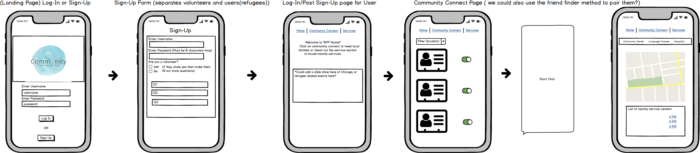
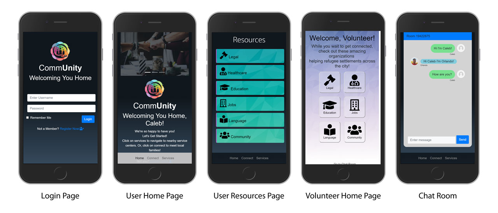

# [comm**Unity** Web App](http://community-chicago.herokuapp.com)
A community building app targeting refugee communities within Chicago and connecting them with local families to help facilitate a smoother transition. 

## Overview
Human interaction is vital to thriving communities. Our App helps refugee communities that have left their homes, to resettle in Chicago by rebuilding their communities and connecting them with local families. Personal interaction is key to their success in adopting Chicago as a home, and our APP helps make that happen.

## Target audience:
Refugee communities that have resettled in Chicago, as well as local families willing to volunteer their time and resources. 

## Screenshots:

## Project Members
* [Purnia Siddiqui](https://github.com/Purnia) Project Leader, Front End, Back End Developer | [GitHub](https://github.com/Purnia) | [LinkedIn]()
* [Orlando Carnate](https://github.com/orlandocarnate) Front End, Back End Developer | [GitHub](https://github.com/orlandocarnate) | [LinkedIn]() 
* [Rodolfo Soto Jr.](https://github.com/rodolfosotojr) Front End, Back End Developer | [GitHub](https://github.com/rodolfosotojr) | [LinkedIn]()
* [Cuauhtemoc Rodriguez](https://github.com/Cuauhtemoc) Front End, Back End Developer | [GitHub](https://github.com/Cuauhtemoc) | [LinkedIn]()

## Technologies, APIS, and Frameworks used:
* Front and Back End technologies:
    * [MySQL](https://www.mysql.com/downloads/) is an Oracle-backed open source relational database management system (RDBMS) based on Structured Query Language (SQL).
    * [Express](http://expressjs.com/) Fast, unopinionated, minimalist web framework for node.
    * [ReactJS](https://reactjs.org/) A JavaScript library for building user interfaces
    * [Node.js](https://nodejs.org/en/) A JavaScript runtime built on Chrome's V8 JavaScript engine.
    * [Bootstrap](https://getbootstrap.com/) An open source toolkit for developing with HTML, CSS, and JS. 

* APIs
    * [Cloudinary](https://cloudinary.com/) Online storage.
    * [Mapbox](https://www.mapbox.com/) Interface to mapbox services.
    * [ChatKit](https://pusher.com/chatkit) In-App Messaging.

* Node packages:
    * [Multer](https://www.npmjs.com/package/multer), [multer-storage-cloudinary](https://www.npmjs.com/package/multer-storage-cloudinary) and [Cloudinary](https://www.npmjs.com/package/cloudinary) to create the upload API route.
    * [@pusher/chatkit-client](https://www.npmjs.com/package/@pusher/chatkit-client) and [@pusher/chatkit-server](https://www.npmjs.com/package/@pusher/chatkit-server) to handle the Chat component.
    * [Mapbox](https://www.npmjs.com/package/mapbox) Interface to mapbox services.
    * [React-INTL](https://www.npmjs.com/package/react-intl) Internationalize React apps. This library provides React components and an API to format dates, numbers, and strings, including pluralization and handling translations.
    * [Express](https://www.npmjs.com/package/express) Fast, unopinionated, minimalist web framework for node.
    * [Express-Session](https://www.npmjs.com/package/express-session) Simple session middleware for Express.
    * [DotEnv](https://www.npmjs.com/package/dotenv) Loads environment variables from .env file.
    * [Passport](https://www.npmjs.com/package/passport) An Express-compatible authentication middleware for Node.js.
    * [Passport-Local](https://www.npmjs.com/package/passport-local) Local username and password authentication strategy for Passport.
    * [BCrypt-NodeJS](https://www.npmjs.com/package/bcrypt-nodejs) A native JS bcrypt library for NodeJS.
    * [Body-Parser](https://www.npmjs.com/package/body-parser) Node.js body parsing middleware.
    * [MySQL2](https://www.npmjs.com/package/mysql2) MySQL client for Node.js with focus on performance. 
    * [Sequelize](https://www.npmjs.com/package/sequelize) A promise-based Node.js ORM for Postgres, MySQL, MariaDB, SQLite and Microsoft SQL Server

## Getting Started
These instructions will get you a copy of the project up and running on your local machine for development and testing purposes. 

### Prerequisites
Clone or Download the Github repository at **(https://github.com/rodolfosotojr/commUnity)**
You will need to install the following software:
* Download and Install **[Node.js](https://nodejs.org/en/)**
* Download and Install **[MySql & MySql Workbench](https://www.mysql.com/downloads/)**
* You will need to provide your own `.env` for the Server and Client folders.
    * In root project folder the `.env` should contain `jwt-secret`, ChatKit Server, MapBox, and Cloudinary keys.
    * In /clients folder the `.env` should contain `jwt-secret`, ChatKit Cient keys.
* Create and download your ChatKit API key at **(https://pusher.com/chatkit)**
* Create and download your Cloudinary API key at **(https://cloudinary.com/)**
* Create and download your MapBox API key at **(https://www.mapbox.com/)**
* From your Gitbash/Terminal window, in the root project folder, run `npm install` to install all the required npm packages.
* Create the database in MySql Workbench: 
    * create a database called `community` and connect to the new database with `use community`
    * Run `npm start` to create the tables for the `community` database. After the application starts the back-end and front-end, you can stop the app by pressing `CTRL-C` twice.
    * To add Resource records to the Resources table, open the /models/Seeds.sql file in Workbench and execute the file.    

## Start the React Application
From your Gitbash/Terminal window, in the root project folder, run `npm start` to run both back-end and front-end node servers. You will now be able to view the local application in your browser at **(http://localhost:3000)**

## Programmer's Notes
Below are some of the challenges we faced creating the React app.

### ChatKit logic
* Volunteers will be able to see a list of private rooms linked to users.
* Users may be limited to a single volunteer or show volunteers that they have chatted with already.

### Upload Image
1. I append the username to the formData using `formData.append('username', this.props.globalusername)`
2. Upload response:
username = req.body.username
updated filename = req.file.filename